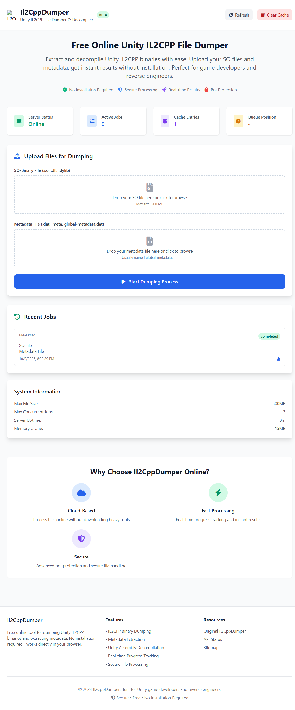

# Il2CppDumper Web Service

[](https://opensource.org/licenses/MIT)
[](https://nodejs.org/)
[](https://docker.com)

A production-ready web service for dumping and decompiling Unity IL2CPP binaries online. Extract assemblies, process metadata, and get readable code without installing desktop tools.

**By [@springmusk026](https://github.com/springmusk026) • [Telegram Channel](https://t.me/Layout_musk)**

## Interface Preview



*The web interface allows users to upload Unity IL2CPP files and monitor processing in real-time.*

## Quick Start

Upload your Unity IL2CPP files through the web interface and receive processed results within minutes. The service handles everything automatically.

### Supported File Types
- **Binary files**: `.so`, `.dll`, `.dylib` (Unity IL2CPP shared libraries)
- **Metadata files**: `.dat`, `global-metadata.dat` (Unity metadata containers)

All processing occurs in real-time with live progress updates and secure file handling.

## Key Features

### Core Processing
- Extract binary files from Unity IL2CPP assemblies
- Process and extract metadata from Unity containers
- Convert assemblies to readable .NET formats
- Real-time progress tracking with live updates
- Comprehensive file validation before processing

### Large File Handling
- Support for chunked uploads up to 500MB
- Resumable uploads that survive network interruptions
- Individual progress tracking for each file chunk
- Memory-optimized processing for large files
- Pre-validation to minimize bandwidth usage

### Security & Reliability
- Cloudflare Turnstile bot protection
- Strict file type verification and validation
- Configurable rate limiting for fair resource usage
- CORS protection for cross-origin requests
- Modern security headers and HTTPS enforcement

### Developer Experience
- RESTful API with comprehensive endpoints
- Server-sent events for real-time progress updates
- Docker containerization for easy deployment
- Structured logging with Winston
- Intelligent caching to avoid redundant processing

## System Requirements

### Runtime Dependencies
- **Node.js**: Version 16.0.0 or higher
- **Il2CppDumper**: .NET Core binary (automatically included in Docker)
- **Docker**: Optional, but recommended for deployment

## Installation

### Docker Deployment (Recommended)

The easiest way to get started is with Docker, which includes all dependencies.

```bash
# Clone the repository
git clone https://github.com/springmusk026/Il2CppDumperWeb.git
cd il2cpp-dumper-server

# Start with Docker Compose
docker-compose up -d

# Access the service at http://localhost:5555
```

### Local Development Setup

For development or custom deployments, install dependencies locally.

```bash
# Clone and install
git clone https://github.com/springmusk026/Il2CppDumperWeb.git
cd il2cpp-dumper-server
npm install

# Configure environment
cp .env.example .env
# Edit .env with your settings

# Start the development server
npm run dev
```

## Configuration

Configure the service using environment variables in a `.env` file:

```env
# Server Configuration
PORT=5555
NODE_ENV=production

# Security Settings
SECRET_KEY=your_turnstile_secret_key
SITE_KEY=your_turnstile_site_key
CORS_ORIGIN=https://yourdomain.com

# Il2CppDumper Path
IL2CPP_DUMPER_PATH=/path/to/Il2CppDumper.dll

# File Upload Limits
MAX_FILE_SIZE=104857600  # 100MB in bytes
ALLOWED_EXTENSIONS=.so,.dll,.dylib,.dat

# Rate Limiting
RATE_LIMIT_WINDOW=15     # Minutes
RATE_LIMIT_MAX_REQUESTS=100

# Processing Limits
MAX_CONCURRENT_JOBS=3
JOB_TIMEOUT=600000       # 10 minutes in ms
CACHE_CLEANUP_INTERVAL=86400000  # 24 hours in ms
```

## API Reference

### Core Processing Endpoints

#### Submit Processing Job
```http
POST /api/dump
Content-Type: multipart/form-data

Form Data:
- soFile: IL2CPP binary file (.so, .dll, .dylib)
- metaFile: Unity metadata file (.dat)
- cf-turnstile-response: Turnstile verification token
```

#### Job Management
```http
GET    /api/jobs/:jobId           # Get job status and details
GET    /api/jobs                  # List jobs with pagination
DELETE /api/jobs/:jobId           # Cancel queued job
GET    /api/jobs/:jobId/progress  # Server-sent events for progress
```

#### System Administration
```http
GET    /api/health                # Service health check
GET    /api/cache/stats           # Cache performance statistics
DELETE /api/cache                # Clear all cached results
DELETE /api/cache/:hash          # Remove specific cache entry
```

#### Chunked File Upload
```http
POST   /api/upload/chunk          # Upload file chunk
GET    /api/upload/chunk          # Check chunk existence
GET    /api/upload/status         # Get upload progress
```

### API Response Format

All API responses follow a consistent structure:

```json
{
  "success": true,
  "data": {
    "jobId": "uuid-v4",
    "status": "processing|completed|failed",
    "progress": 45,
    "message": "Processing files...",
    "downloadUrl": "/api/download/uuid-v4.zip",
    "files": {
      "soFile": "libil2cpp.so",
      "metaFile": "global-metadata.dat"
    }
  }
}
```

## Usage Examples

### JavaScript Client

```javascript
// Submit files for processing
const formData = new FormData();
formData.append('soFile', document.getElementById('soFile').files[0]);
formData.append('metaFile', document.getElementById('metaFile').files[0]);

const response = await fetch('/api/dump', {
  method: 'POST',
  body: formData
});

const result = await response.json();
if (result.success) {
  console.log('Job created:', result.data.jobId);
  // Connect to progress stream
  const eventSource = new EventSource(`/api/jobs/${result.data.jobId}/progress`);
  eventSource.onmessage = (event) => {
    const progress = JSON.parse(event.data);
    console.log(`Progress: ${progress.progress}% - ${progress.message}`);
  };
}
```

### cURL Examples

```bash
# Submit processing job
curl -X POST http://localhost:5555/api/dump \
  -F "soFile=@libil2cpp.so" \
  -F "metaFile=@global-metadata.dat"

# Check job status
curl http://localhost:5555/api/jobs/your-job-id

# Get system health
curl http://localhost:5555/api/health
```

## Production Deployment

### Recommended Hosting

For hosting this application in production, we recommend [ZapVPS](https://zapvps.com/aff.php?aff=1) - a reliable VPS provider with excellent performance and support.

**Special Offer**: Use promo code `SPRINGMUSK` for 50% off your first purchase!

ZapVPS provides:
- 10Gbps network connectivity
- AMD EPYC processors
- 99.9% uptime guarantee
- 24/7 technical support
- Easy scaling options

### Docker Compose Setup

For production deployment, use the provided Docker Compose configuration:

```yaml
version: '3.8'
services:
  il2cpp-dumper:
    build:
      context: .
      dockerfile: Dockerfile
    ports:
      - "5555:5555"
    environment:
      - NODE_ENV=production
      - PORT=5555
      - MAX_FILE_SIZE=104857600
    volumes:
      - ./uploads:/app/uploads:rw
      - ./logs:/app/logs:rw
      - ./.env:/app/.env:ro
    restart: unless-stopped
    healthcheck:
      test: ["CMD", "curl", "-f", "http://localhost:5555/api/health"]
      interval: 30s
      timeout: 10s
      retries: 3
```

### Environment Configuration

Set these environment variables for production:

```bash
# Required for production
NODE_ENV=production
PORT=5555
SECRET_KEY=your_cloudflare_turnstile_secret
SITE_KEY=your_cloudflare_turnstile_site_key

# File and processing limits
MAX_FILE_SIZE=104857600        # 100MB
MAX_CONCURRENT_JOBS=5          # Adjust based on server capacity
JOB_TIMEOUT=900000             # 15 minutes

# Security
CORS_ORIGIN=https://yourdomain.com
ENABLE_HASH_CHECK=true         # Enable caching
```

## SEO & Web Standards

### Search Engine Optimization
- Dynamic sitemap generation at `/sitemap.xml`
- Comprehensive robots.txt configuration
- Open Graph and Twitter Card meta tags
- Structured data markup for rich snippets
- Mobile-responsive design with modern CSS

### Content Strategy
- Optimized meta descriptions for Unity/IL2CPP keywords
- Social media sharing integration
- Progressive Web App capabilities
- Fast loading with optimized assets

## Development

### Architecture Overview

```
il2cpp-dumper-server/
├── config/           # Environment and application configuration
├── controllers/      # Express route handlers and business logic
├── middleware/       # Custom Express middleware (auth, upload, etc.)
├── routes/          # API and web route definitions
├── services/        # Core services (JobManager, SSE, etc.)
├── utils/           # Utility functions and helpers
├── views/           # EJS templates for web interface
├── public/          # Static assets (CSS, JS, images)
├── uploads/         # Temporary file storage
└── logs/           # Application logging output
```

### Development Scripts

```bash
npm run dev          # Start development server with hot reload
npm start            # Start production server
npm run lint         # Run ESLint code quality checks
npm run lint:fix     # Auto-fix linting issues
npm test             # Execute test suite
npm run docker:build # Build Docker image
npm run docker:up    # Start with Docker Compose
npm run clean        # Clean uploads, logs, and cache
```

## Contributing

We welcome contributions! Please follow these steps:

1. Fork the repository
2. Create a feature branch (`git checkout -b feature/amazing-feature`)
3. Make your changes with tests
4. Ensure all tests pass (`npm test`)
5. Commit your changes (`git commit -m 'Add amazing feature'`)
6. Push to the branch (`git push origin feature/amazing-feature`)
7. Open a Pull Request

### Development Guidelines
- Follow ESLint configuration
- Add tests for new features
- Update documentation as needed
- Use conventional commit messages

## License

This project is licensed under the MIT License - see the [LICENSE](LICENSE) file for details.

## Acknowledgments

### Core Technology
- **[Il2CppDumper](https://github.com/Perfare/Il2CppDumper)**: Original reverse engineering tool by Perfare - the foundation of this project

### Open Source Dependencies
This project builds upon these excellent open source libraries:

#### Runtime Dependencies
- **[Express.js](https://expressjs.com/)**: Fast, unopinionated web framework for Node.js
- **[Winston](https://github.com/winstonjs/winston)**: Versatile logging library
- **[Multer](https://github.com/expressjs/multer)**: Middleware for handling multipart/form-data
- **[Helmet](https://helmetjs.github.io/)**: Security middleware for Express.js
- **[Archiver](https://github.com/archiverjs/node-archiver)**: Streaming interface for archive generation
- **[Axios](https://axios-http.com/)**: Promise-based HTTP client
- **[UUID](https://github.com/uuidjs/uuid)**: RFC4122 UUID generation
- **[EJS](https://ejs.co/)**: Embedded JavaScript templating
- **[Express Rate Limit](https://github.com/express-rate-limit/express-rate-limit)**: Rate limiting middleware
- **[CORS](https://github.com/expressjs/cors)**: Cross-Origin Resource Sharing middleware
- **[Compression](https://github.com/expressjs/compression)**: Response compression middleware
- **[Busboy](https://github.com/mscdex/busboy)**: Streaming parser for HTML form data
- **[Dotenv](https://github.com/motdotla/dotenv)**: Environment variable loading

#### Development Dependencies
- **[ESLint](https://eslint.org/)**: Pluggable linting utility for JavaScript
- **[Jest](https://jestjs.io/)**: Delightful JavaScript testing framework
- **[Nodemon](https://nodemon.io/)**: Utility that monitors for changes and restarts server
- **[Supertest](https://github.com/ladjs/supertest)**: HTTP endpoint testing library

### Community
- **Unity Community**: For their contributions to reverse engineering and game development
- **Open Source Contributors**: For their valuable input and improvements

## Support

- **Issues**: [GitHub Issues](https://github.com/springmusk026/Il2CppDumperWeb/issues)
- **Discussions**: [GitHub Discussions](https://github.com/springmusk026/Il2CppDumperWeb/discussions)
- **Documentation**: [Wiki](https://github.com/springmusk026/Il2CppDumperWeb/wiki)

---

*Built for the Unity development and reverse engineering community.*
